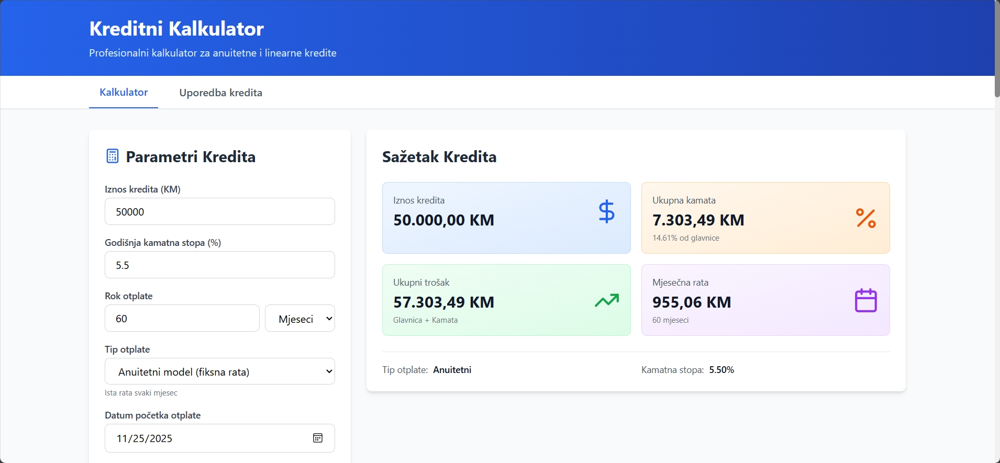
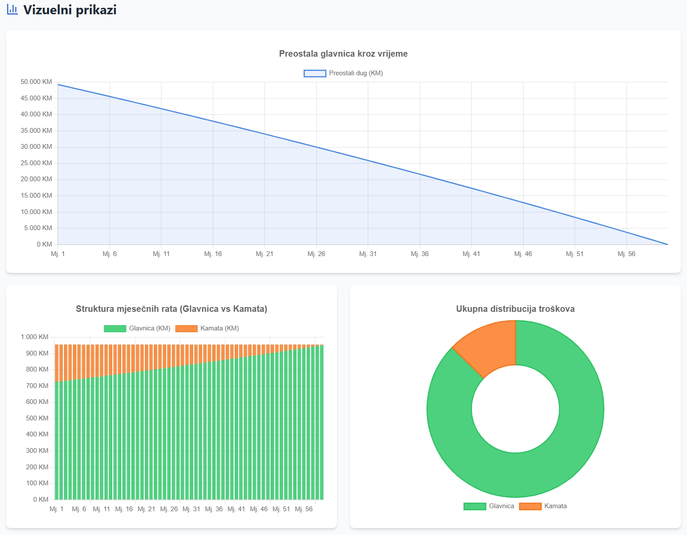
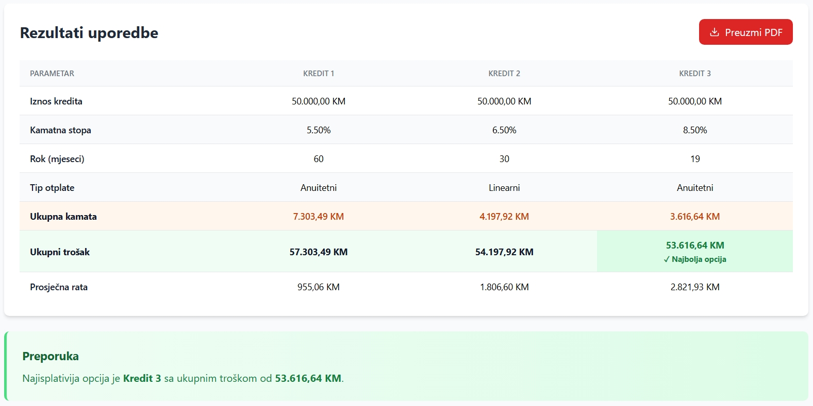
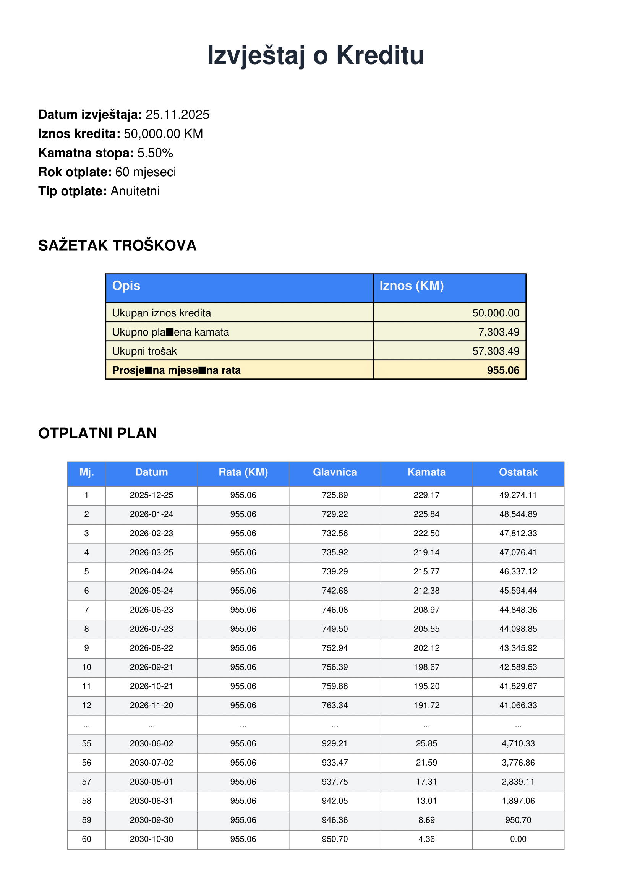

# 💳 Credit Calculator

> A full‑stack web application for loan calculation, comparison, visualization and PDF/CSV report export built with **React (Vite)** on the frontend and **FastAPI (Python)** on the backend.

---

## 🎯 Purpose

The **Credit Calculator** helps users understand the full cost of a loan before making a financial commitment. It provides:

* clear amortization schedules,
* monthly payment insights,
* interest vs principal breakdowns,
* early repayment simulations,
* and side‑by‑side loan comparisons.

Designed for students, financial analysts and anyone exploring different credit scenarios.

---

## 📦 Core Features

* **📐 Standard Loan Calculator:** monthly installment, total interest, total repayment.
* **🧮 Annuity & Linear Repayment Models:** fully supported with transparent formulas.
* **⚡ Early Repayment Simulation:** analyze savings with partial or full early payoff.
* **↕ Adjustable Interest Rate Scenarios:** simulate rate changes (+1%, -0.5%, etc.).
* **🔁 Loan Comparison Tool:** compare 2–3 loans with an automatic recommendation.
* **📈 Visualization Dashboard:** interactive charts for balance, principal and interest.
* **📄 PDF & CSV Export:** generate printable reports and export amortization tables.
* **📱 Responsive UI:** optimized for desktop, tablet and mobile.

---

## 🖼️ Gallery

Visual previews of key interfaces. Images should be placed in the `images/` folder of the repository.

<table>
  <tr>
    <td align="center">
      <br/>
      <b>Home Screen - Dashboard</b>
      <p>Main panel with input fields, summary cards- quick navigation options.</p>
    </td>
    <td align="center">
      <br/>
      <b>Payment Schedule Chart</b>
      <p>Interactive chart showing remaining balance and principal/interest structure.</p>
    </td>
  </tr>
  <tr>
    <td align="center">
      <br/>
      <b>Loan Comparison View</b>
      <p>Side-by-side comparison of multiple loans with a recommended option.</p>
    </td>
    <td align="center">
      <br/>
      <b>PDF Report Preview</b>
      <p>Example of a generated report containing summary, charts- full amortization table.</p>
    </td>
  </tr>
</table>

---

## 🧰 Technology Stack

| Layer        | Technologies                                               |
| ------------ | ---------------------------------------------------------- |
| **Frontend** | React 18, Vite, TailwindCSS, Chart.js, Axios, Lucide React |
| **Backend**  | Python 3.11+, FastAPI, Pydantic, Uvicorn, ReportLab        |
| **Other**    | Git, npm/yarn                                              |

---

## 🏗️ Architecture Overview

The application is structured as a decoupled **full‑stack system**, communicating through JSON REST APIs.

### Frontend Components

* `App.jsx`
* `CreditForm.jsx`
* `CreditSummary.jsx`
* `Charts.jsx`
* `PaymentScheduleTable.jsx`
* `AdvancedFeatures.jsx`
* `ComparisonTool.jsx`

### Backend Components

* `app/main.py`
* `app/models/credit.py`
* `app/services/credit_calculator.py`
* `app/services/pdf_generator.py`

---

## 🔌 REST API Endpoints

* **POST /calculate** - standard credit calculation
* **POST /calculate/prepayment** - early repayment simulation
* **POST /calculate/rate-change** - simulate interest rate variations
* **POST /compare** - compare multiple loans
* **POST /export/pdf** - export amortization analysis as PDF
* **POST /export/comparison-pdf** - export comparison PDF

---

## 📐 Mathematical Models

### Annuity Model (Fixed Installments)

```
A = P × [r(1+r)^n] / [(1+r)^n - 1]
```

Where:

* **A** - monthly installment
* **P** - principal amount
* **r** - monthly interest rate
* **n** - total number of months

### Linear Model (Declining Installments)

* Monthly principal: `P / n`
* Monthly interest: `remaining_principal × r`
* Monthly payment: `principal + interest`

---

## 🚀 Installation & Local Development

### Requirements

* Python 3.11+
* Node.js 18+
* npm or yarn

### 1. Clone the Repository

```bash
git clone https://github.com/demirhalilbasic/credit-calculator.git
cd credit-calculator
```

### 2. Backend Setup

```bash
cd backend
python -m venv venv
# Windows
venv\Scripts\activate
# Linux / MacOS
# source venv/bin/activate
pip install -r requirements.txt
uvicorn app.main:app --reload
```

### 3. Frontend Setup

```bash
cd ../frontend
npm install
npm run dev
```

Frontend: `http://localhost:3000`
API Docs: `http://localhost:8000/docs`

---

## ⚙️ Configuration

* Select repayment type (annuity / linear)
* Enter early repayment amount (partial or full)
* Quick rate adjustments (+1%, +0.5%, –0.5%, –1%)

---

## 🤝 Contributing

1. Fork the repository
2. Create a feature branch
3. Commit your changes
4. Open a pull request

---

## ✉️ Contact

[](https://www.linkedin.com/in/demir-halilbasic/) [](https://www.youtube.com/@DemkyDesignHub)

---

## 🙌 Feedback

Thank you for exploring the **Credit Calculator**!
If you have feedback, suggestions or collaboration ideas, feel free to open an issue or reach out directly.
